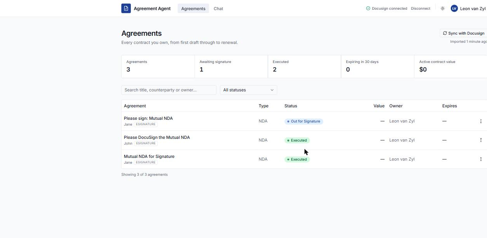
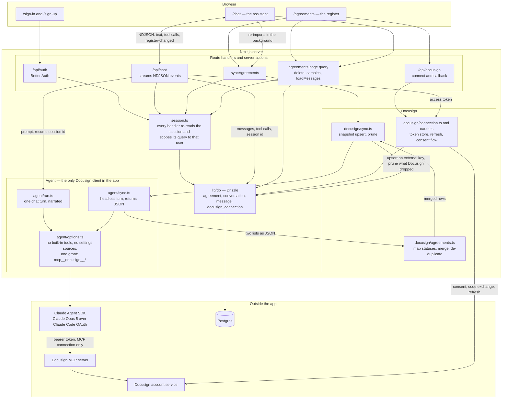
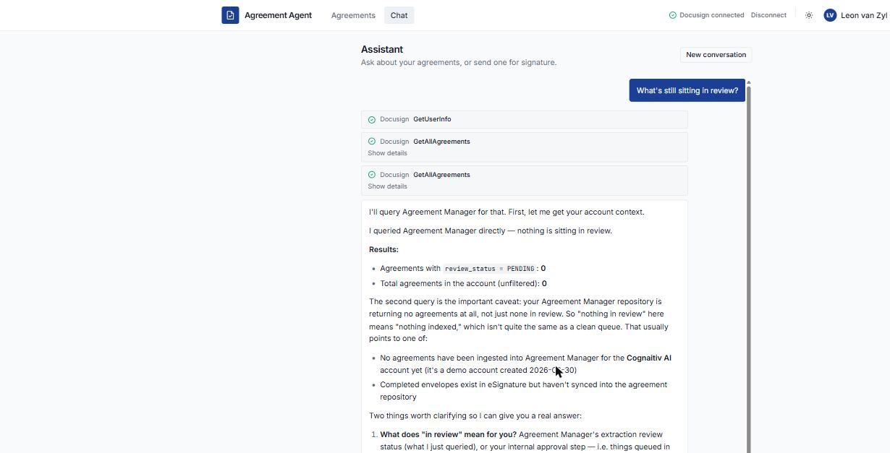

# Agreement Agent

An internal tool for managing the team's contracts. Three screens: a login, an
agreements register, and an assistant.



The register, imported from a live Docusign account. The `ESIGNATURE` chips mark rows
built from envelopes rather than Agreement Manager records — which is also why their
value and expiry columns are empty. An envelope doesn't carry a term.

## Running it

You need [Docker Desktop](https://www.docker.com/products/docker-desktop/) running —
that's where the database lives.

```bash
pnpm install
pnpm db:up       # starts Postgres in Docker
pnpm db:migrate  # creates the tables
pnpm dev         # http://localhost:3000
```

Stop the database with `pnpm db:down`. Your data survives — it lives in a Docker
volume, not in the container.

Create an account at `/sign-up` and you'll land on the register.

## The three screens

| Route | What it is |
| --- | --- |
| `/sign-in` | The login screen. `/sign-up` creates an account. |
| `/agreements` | The register — every contract you own, with status and renewal dates. |
| `/chat` | The assistant. |

`/` isn't a screen; it sends you to the register when signed in and the login screen
when not.

## How it fits together

Everything runs inside one Next.js app. There are three things outside it: Postgres,
the Claude Agent SDK, and Docusign — and Docusign is reached twice, once for OAuth
and once, through the agent, for the actual work.



Two paths are worth tracing. A **chat turn** goes `/chat` → `/api/chat` → `run.ts` →
the SDK → Docusign's MCP server, and streams back token by token; if the agent
changed something upstream, the browser quietly re-runs the import. A **register
sync** goes the same way but headless — `sync.ts` asks the agent for both Docusign
lists as JSON, `agreements.ts` merges them, and the result replaces the imported rows
in Postgres.

## What's real and what isn't

**Real:** accounts and sign-in, the database, the agreements table with search,
filtering and delete, chat threads that persist across refreshes, the Docusign OAuth
connection, an assistant that actually calls Docusign, and a register imported from
your real Docusign account.

There is deliberately no form for creating agreements — they come from Docusign, via
**Sync with Docusign**. If you'd rather see the screen populated without connecting an
account, **Load sample agreements** on the empty state writes ordinary records you can
delete like any other.

**Not in this version:** contract PDF uploads, teams and sharing, notifications, and
an audit log.

## The assistant

The chat is backed by an agent built with the
[Claude Agent SDK](https://code.claude.com/docs/en/agent-sdk), running Claude Opus 5.
Its one capability is Docusign, reached through Docusign's [remote MCP server](https://developers.docusign.com/platform/mcp-server/).



Every Docusign call is surfaced as it runs — here the agent reaches for Agreement
Manager to answer a question about the portfolio, which is the routing the system
prompt asks for. The table is for display; Agreement Manager is the query layer.

| File | What it does |
| --- | --- |
| `src/lib/agent/config.ts` | The model and the prompts — edit the agent's behaviour here |
| `src/lib/agent/options.ts` | What the agent is allowed to be, defined once for both callers |
| `src/lib/agent/run.ts` | Normalises a chat turn into UI events |
| `src/lib/agent/tools.ts` | MCP tool naming, shared with the client |
| `src/lib/agent/events.ts` | The NDJSON wire format between the route and the browser |
| `src/app/api/chat/route.ts` | Auth, persistence, and the streaming response |

Four things are worth knowing before you change it.

**It signs in as you, not as an API key.** The SDK resolves credentials in a fixed
order and an API key beats everything else, so `buildAgentEnv` in `config.ts` deletes
`ANTHROPIC_API_KEY` and `ANTHROPIC_AUTH_TOKEN` from the agent's environment — one
exported in your shell for something unrelated would otherwise take over silently and
bill that account. What's left is Claude Code's own OAuth, read from
`~/.claude/.credentials.json`. Set `CLAUDE_CODE_OAUTH_TOKEN` (from
`claude setup-token`) only where there's no interactive login to inherit. Note that
running on a Claude Code subscription means the agent shares your rate limits — and
Anthropic asks that products offered to *other* people use API-key auth instead.

**The agent has no tools of its own.** The Agent SDK is Claude Code as a library, so
left alone it arrives with a shell and a file editor. `options.ts` sets `tools: []` to
switch all of that off and grants exactly one thing back — `mcp__docusign__*`. It
also sets `settingSources: []` and `strictMcpConfig: true`, so your personal
`~/.claude` config, the repo's `CLAUDE.md`, and `.mcp.json` have no effect on how the
app behaves for its users. Both callers — the chat turn and the register sync — share
that one builder, so the headless one can't quietly end up more permissive.

**The Docusign token only authorises the MCP connection.** It goes into an
`Authorization` header on the MCP server config and nowhere else — never into the
prompt, never to the browser. `getValidAccessToken` refreshes it first if it's stale.

**Threads resume by SDK session.** `conversation.agent_session_id` points at the
transcript the SDK keeps on disk, which is what lets "yes, send it" refer back to the
envelope proposed a turn earlier. It's disposable: if the session can't be resumed the
turn starts fresh rather than failing. Postgres, not the SDK, is the durable record.

Replies stream token by token, and every Docusign call the agent makes is shown in
the transcript as it runs — then saved to `message.tool_calls` so it survives a
refresh.

## Where the register comes from

The agreements table is built from Docusign, and Docusign answers the question twice:

- **eSignature** knows about envelopes the moment they're sent, including ones still
  going round for signature. It's the only source that can show something in flight —
  but an envelope carries no value and no term.
- **[Agreement Manager](https://developers.docusign.com/docs/agreement-manager-api/)** knows about agreements once they exist as agreements, with the
  counterparty, the value and the dates. Richer, but it has nothing to say about the
  envelope you sent thirty seconds ago.

So both are read and merged. The same item appears in both — once as the envelope that
carried it, once as the agreement it became — so rows are de-duplicated on the envelope
id, falling back to the Agreement Manager id. Where an item is in both, the Agreement
Manager record wins field by field, with the envelope filling any gaps it left.

| File | What it does |
| --- | --- |
| `src/lib/agent/sync.ts` | Runs a headless agent turn that returns both lists as JSON |
| `src/lib/docusign/agreements.ts` | Reads that payload, maps Docusign's statuses, merges the two sources |
| `src/lib/docusign/sync.ts` | Writes the merged list into the register |

Three things are worth knowing.

**The agent is the Docusign client here too.** There's no second, direct integration —
the MCP server decides what the tools are called, and a hand-written REST client
beside it would be a copy that drifts. The agent does the reading and the judgement
calls (which tools exist, what a document *is*); everything mechanical — the status
vocabulary, the de-duplication, which record wins — is plain code, so it behaves the
same on every run.

**It refreshes itself after a send.** When a chat turn calls a Docusign tool that
changes something, the route emits a `register-changed` event and the browser
re-imports in the background, so an agreement sent in conversation is in the table by
the time you look. Pressing **Sync with Docusign** does the same thing by hand.

**The table is for display; Agreement Manager is the query layer.** Ask the assistant
"every unsigned NDA this quarter" and it queries Agreement Manager — it does not read
this app's database, and it's told not to. The merged table is what you look at, not
what the agent thinks with.

Rows you added yourself are never touched by an import, and a Docusign row that no
longer exists upstream is removed — an import is a snapshot, not an append.

## Your data is your own

Agreements and chat threads are private to each account. Every query filters on the
signed-in user, and every server action re-checks the session and re-asserts ownership
in its `WHERE` clause — a server action is a public endpoint, so it never trusts an id
sent from the browser.

## Changing the database schema

Never `drizzle-kit push`. It leaves no migration history and will silently drop a
column with real data in it. Always:

```bash
pnpm db:generate   # writes a reviewable SQL file into drizzle/
# read what it produced — a DROP COLUMN you didn't intend is obvious there
pnpm db:migrate    # applies it
```

The `drizzle/` folder is source code. Commit it.

Better Auth owns the `user`, `session`, `account` and `verification` tables. They're
generated, never hand-edited:

```bash
pnpm dlx @better-auth/cli@latest generate --config src/lib/auth.ts --output src/lib/db/auth-schema.ts -y
```

Re-run that after upgrading `better-auth`, then generate and apply a migration.

## Environment

`.env` is gitignored. It holds:

- `POSTGRES_URL` — where the data lives.
- `BETTER_AUTH_SECRET` — signs login sessions. Regenerate with `openssl rand -base64 32`.
- `BETTER_AUTH_URL` — the app's own address.
- `DOCUSIGN_*` — the Docusign OAuth connection. See the comments in `.env`.
- `CLAUDE_CODE_OAUTH_TOKEN` — **optional**, and unset in development. See below.

There is no `ANTHROPIC_API_KEY`. The assistant authenticates with Claude Code's
OAuth, so locally it just runs as whoever is signed in — if `claude login` works in
your terminal, the assistant works.

If Postgres isn't reachable, the app doesn't crash — it shows a notice telling you to
run `pnpm db:up`. Likewise, an expired Claude Code login or an unconnected Docusign
account surfaces as a message in the chat rather than a 500.

## Going to production

Config, not code. Docker Compose is a local convenience; nothing here deploys as a
container.

- Point `POSTGRES_URL` at a hosted Postgres in your host's environment variables.
- Set `BETTER_AUTH_SECRET` to a fresh value and `BETTER_AUTH_URL` to the real domain.

## Styling

One direction, set in one place: the CSS variables at the top of
`src/app/globals.css`. Deep indigo primary, cool-grey neutrals, a tight `0.3rem`
radius, Inter. Agreement status colours are there too, as `.status-*` classes keyed by
the database enum. Don't hard-code colours in components — change them here and both
light and dark themes follow.
